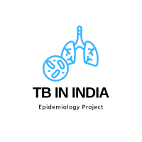
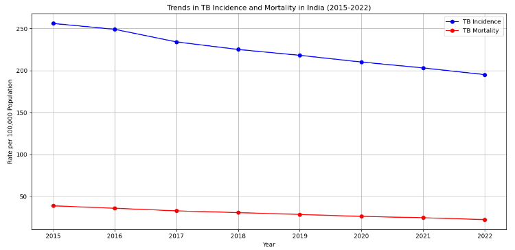

# National TB Report Summary - Chapter 2
> **Brief Description:** - Chapter 2 of the "India TB Report 2023" focuses on the country's progress towards achieving the Sustainable Development Goals (SDGs) related to Tuberculosis (TB), particularly the goal of ending the TB epidemic by 2030. The chapter outlines various strategies and initiatives implemented to estimate and track the TB burden, improve diagnostics, engage the private sector, and enhance treatment outcomes.
> 

---

## Table of Contents

- [Summary](#summary)
- [Program Codes ](#program-codes)
- [Plots](#plots)
- [Contribution](#contributipn)
- [Contact Details](#contact-details)

---

##Summary
**Chapter 2 of the "India TB Report 2023" focuses on the country's progress towards achieving the Sustainable Development Goals (SDGs) related to Tuberculosis (TB), particularly the goal of ending the TB epidemic by 2030. The chapter outlines various strategies and initiatives implemented to estimate and track the TB burden, improve diagnostics, engage the private sector, and enhance treatment outcomes.**

### Key Highlights:

#### Estimation of TB Burden:
- Historically, estimating the TB burden in terms of incidence and mortality has been challenging due to aggregated reporting and low coverage of case-based surveillance systems.
- Introduction and scaling up of Ni-kshay, a case-based web-based surveillance system, since 2012 has significantly improved the quality of TB notification data.

#### Private Sector Engagement:
Mandatory notification and increased engagement with the private sector have resulted in a sevenfold increase in private sector notifications since 2014, which now account for over 30% of total notifications.

#### Improved Diagnostics:
Decentralization of microscopy services and scaling up of Nucleic Acid Amplification Tests (NAAT) have enhanced the quality of TB diagnosis across the country.

#### Treatment and Patient Tracking:
Implementation of a daily regimen for first-line TB treatment in 2017 harmonized treatment in both public and private sectors.
Ni-kshay's patient tracking capabilities have improved treatment outcomes by reducing loss to follow-up cases.

#### Active Case Finding:
Active case finding initiatives have enabled screening large sections of the vulnerable and general population, facilitating early diagnosis and reducing transmission rates.

#### National TB Prevalence Survey:
The National TB Prevalence Survey provided state-level estimates and highlighted the diversity of TB burden across the country.
Vital registration data on causes of death, published by the Registrar General of India, has been valuable for understanding TB mortality.

#### Sub-national Certification:
This innovative method involves in-depth data verification, community-based surveys, and drug sales information at the district level, allowing for accurate TB incidence estimation at the state and district levels.

#### Mathematical Modeling:
An in-country dynamic mathematical model was developed to estimate TB incidence and mortality. The model was calibrated using various data sources, including prevalence surveys, notification rates, and mortality data.

## Program-codes

The programs are written on jupiter notebook, You may run the program on Google colab by clicking on the colab badge below. However, the output may not be generated on colab. For that you have to download the program and run it locally. Make sure that the packages are all installed.

## Plots

A visual plot showing the trends in TB incidence and mortality from 2015 to 2022 based on the data provided in the report.

## Contribution

The reports and programs are written by Santanu Karmakar

## Contact-details

If you wish to contact me, please leave a message (Preferably WhatsApp) on this number: 6291 894 897.
Please also mention why you are contacting me. Include your name and necessary details.
Thank you for taking an interest.
